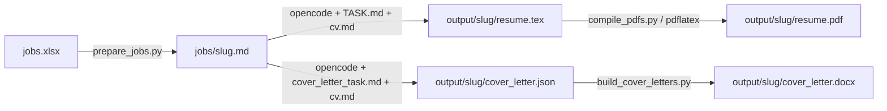

# Loom

**Spreadsheet in → tailored résumé PDFs (and cover-letter DOCX files) out.**

Loom turns a list of job postings into per-role LaTeX résumés and PDFs using one source CV, a fixed LaTeX template, and [OpenCode](https://opencode.ai/docs/cli) for AI-driven tailoring. A parallel path produces structured cover letters as JSON, then converts them to Word documents.

---

## How it works



1. `scripts/prepare_jobs.py` reads `jobs.xlsx` and writes one markdown file per job.
2. `opencode run` reads the job file, your `cv.md`, and the LaTeX template, then writes a tailored `resume.tex`.
3. `scripts/compile_pdfs.py` runs `pdflatex` on every `resume.tex` to produce a PDF.
4. Optionally, `opencode run` writes a `cover_letter.json`, and `scripts/build_cover_letters.py` converts it to a DOCX.

`run_all.sh` and `run_with_cover_letter.sh` automate the full pipeline end-to-end.

---

## Prerequisites

| Dependency | Purpose | Install |
|---|---|---|
| Python 3 + `pandas`, `openpyxl` | Read `jobs.xlsx` | `pip install pandas openpyxl` |
| `python-docx` | Build cover-letter DOCX files | `pip install python-docx` |
| [OpenCode](https://opencode.ai/) CLI | AI tailoring step | See [opencode.ai/docs/cli](https://opencode.ai/docs/cli) |
| `pdflatex` (TeX Live / MacTeX / MiKTeX) | Compile `.tex` → PDF | OS package manager |

---

## Setup

1. **CV** — Copy `cv.example.md` to `cv.md` and fill it in with your real experience. This is the content pool the AI draws from when tailoring each résumé.

2. **Jobs** — Add `jobs.xlsx` at the repo root. `scripts/prepare_jobs.py` expects these columns:

   | Column | Required | Notes |
   |---|---|---|
   | `Company` | Yes | |
   | `Title` | Yes | |
   | `Location` | Yes | |
   | `About_the_job` | Yes | Full job description text |
   | `Category` | Yes | Used for filtering |
   | `Salary` | No | |
   | `Status` | No | |
   | `Company_Intro` | No | Rendered as a `## Company Intro` section in the job file |

   Edit the script if your column names differ.

3. **Template** — Adjust `templates/template.tex` for your heading and education. Experience, projects, and skills sections are filled in by OpenCode at runtime.

---

## Running the pipeline

### Résumés only

```bash
chmod +x run_all.sh   # once
./run_all.sh          # optional: --limit 10, --filter-company "Name"
```

### Résumés + cover letters

```bash
chmod +x run_with_cover_letter.sh   # once
./run_with_cover_letter.sh          # optional: --limit N, --filter-company "Name"
```

### Manual step-by-step

```bash
# 1. Parse spreadsheet → job markdown files
python scripts/prepare_jobs.py --skip-existing

# 2. Tailor one résumé with OpenCode
opencode run "Read prompts/TASK.md, cv.md, and templates/template.tex. Then process only this one job file: jobs/Some_Job.md. Write the tailored resume to the output path listed inside it."

# 3. Compile all pending PDFs
python scripts/compile_pdfs.py --skip-existing

# 4. Write one cover letter with OpenCode
opencode run "Read prompts/cover_letter_task.md, cv.md, and templates/cover_letter_template.md. Then process only this one job file: jobs/Some_Job.md. Write the cover letter data to output/<slug>/cover_letter.json (valid JSON only, schema in templates/cover_letter_template.md)."

# 5. Build DOCX files from JSON
python scripts/build_cover_letters.py --skip-existing
```

> **Note on `opencode run`:** The `run` subcommand ensures the prompt string is not mistaken for a project path. See the [OpenCode CLI docs](https://opencode.ai/docs/cli).

---

## Cover letter letterhead

Name, address, phone, email, and links are set as constants at the top of `scripts/build_cover_letters.py`. Edit those before your first run.

---

## Local dashboard

A **localhost-only** browser UI that lets you manage the entire pipeline without touching the command line.

```bash
pip install -r dashboard_requirements.txt
uvicorn dashboard.app:app --host 127.0.0.1 --port 8000 --reload
```

Open [http://127.0.0.1:8000](http://127.0.0.1:8000).

### Job table

The main view lists every job found across `jobs/` and `output/`, sorted by most recently modified. For each row you can see:

- Company, title, location, category, and salary parsed from the job markdown
- Artifact indicators showing which of `resume.tex`, `resume.pdf`, `cover_letter.json`, and `cover_letter.docx` exist
- Inline file preview or download links for each artifact (PDFs open inline; `.tex`/`.json` render in a styled code view)
- A direct link to the original job posting URL (read from `jobs.xlsx`)

### Application status tracking

Each job has a status dropdown — **Not Applied**, **Applied**, **Reject**, or **Ignore** — that writes back to both a local `dashboard_statuses.json` file and the `Status` column in `jobs.xlsx` simultaneously.

### Pipeline controls

All operations stream stdout/stderr live into the browser and can be cancelled at any time.

| Action | What it does |
|---|---|
| **Prepare jobs** | Runs `prepare_jobs.py` with optional `--limit`, `--filter-company`, `--filter-category`, and `--skip-existing` flags |
| **Tailor résumé** | Runs `opencode run` with `prompts/TASK.md` for a single job, a selection, or all jobs missing a `resume.tex` |
| **Write cover letter** | Runs `opencode run` with `prompts/cover_letter_task.md` for a single job, a selection, or all jobs missing a `cover_letter.json` |
| **Compile PDFs** | Runs `scripts/compile_pdfs.py` |
| **Build DOCX** | Runs `scripts/build_cover_letters.py` |
| **Full pipeline** | Runs all five steps above in sequence |

### Resume refinement

Once a PDF exists, two refinement actions are available per job (powered by the Claude CLI):

- **Remove bullet** — identifies and removes the single least-relevant `\resumeItem` relative to the job description, then recompiles the PDF
- **Add bullet** — finds the single most-relevant bullet from `cv.md` that isn't already in the résumé, inserts it under the best-matching role or project, then recompiles the PDF

### Quick Add

Paste raw text from a LinkedIn, Indeed, or Handshake job posting into the Quick Add panel. The dashboard parses it into structured fields (company, title, location, description, URL, etc.) and appends a new row to `jobs.xlsx` — no spreadsheet editing required.

### Diagnostics

A diagnostics panel checks that all required commands (`python`, `opencode`, `claude`, `pdflatex`) are on your `PATH` and that all required Python packages are importable, so you can catch missing dependencies before running the pipeline.

Keep the server bound to `127.0.0.1` — it is not designed for public exposure.

---

## Privacy

`.gitignore` excludes `cv.md`, `jobs.xlsx`, `jobs/`, and `output/`, so your résumé content, job descriptions, generated TeX/PDFs, and cover letters stay local and off remote.
